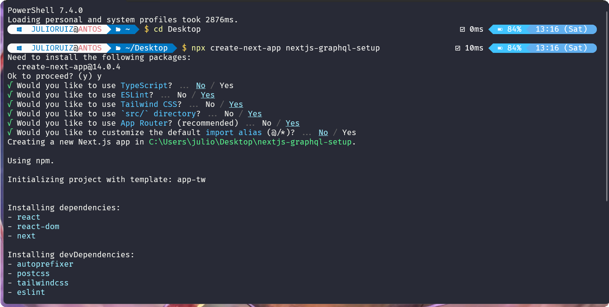
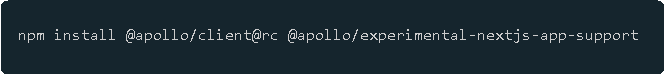
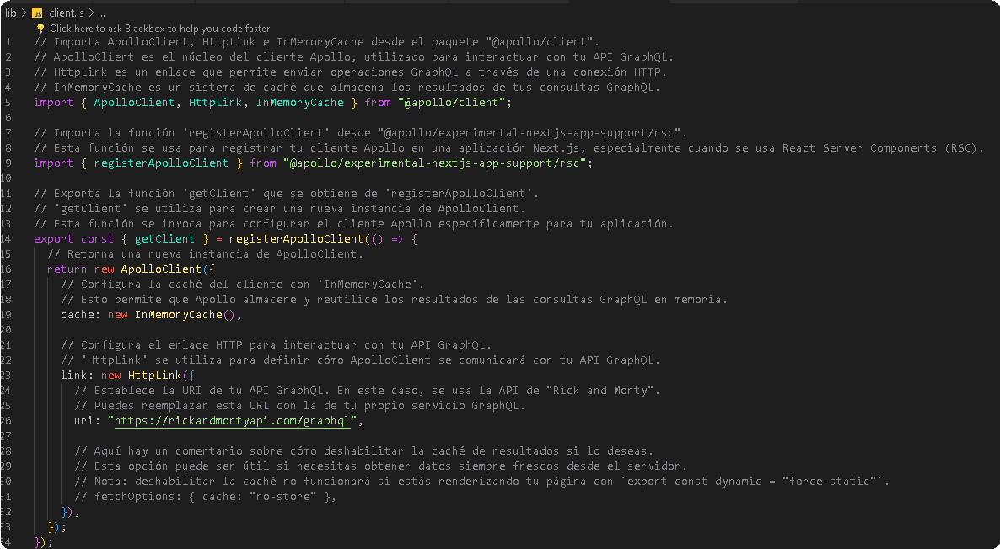
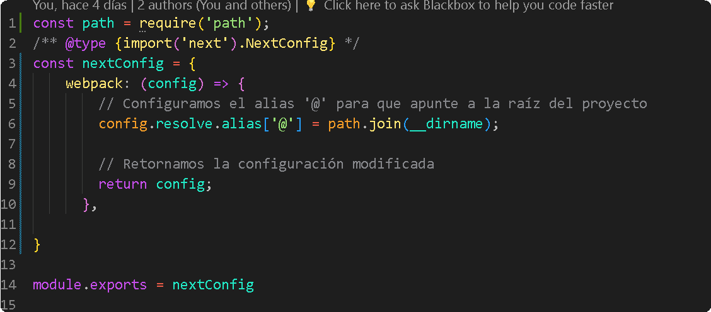
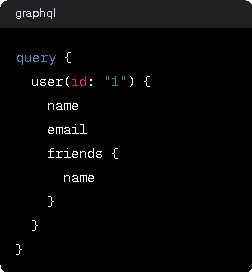

This is a [Next.js](https://nextjs.org/) project bootstrapped with [`create-next-app`](https://github.com/vercel/next.js/tree/canary/packages/create-next-app).

## Getting Started

First, run the development server:

```bash
npm run dev
# or
yarn dev
# or
pnpm dev
# or
bun dev
```

Open [http://localhost:3000](http://localhost:3000) with your browser to see the result.

You can start editing the page by modifying `app/page.js`. The page auto-updates as you edit the file.

This project uses [`next/font`](https://nextjs.org/docs/basic-features/font-optimization) to automatically optimize and load Inter, a custom Google Font.

## Learn More

To learn more about Next.js, take a look at the following resources:

- [Next.js Documentation](https://nextjs.org/docs) - learn about Next.js features and API.
- [Learn Next.js](https://nextjs.org/learn) - an interactive Next.js tutorial.

You can check out [the Next.js GitHub repository](https://github.com/vercel/next.js/) - your feedback and contributions are welcome!

## Deploy on Vercel

The easiest way to deploy your Next.js app is to use the [Vercel Platform](https://vercel.com/new?utm_medium=default-template&filter=next.js&utm_source=create-next-app&utm_campaign=create-next-app-readme) from the creators of Next.js.

Check out our [Next.js deployment documentation](https://nextjs.org/docs/deployment) for more details.


# GUIA DE INSTALACION 



Para crear un componente basico se usa \"rfce\"

Para comunicar next.js con un backend de graphql necesitamos de la biblioteca de \"APOLO\"

Los paquetes que se necesitan para instalar next.js junto a apolo pide dos paquetes

El \"@apollo/client@rc \" esta en un version de realese candidate es como una version

Antes de lanzarse la version estable El \"apollo/experimental-nextjs-app-support\" es para que podamos tener soporte

De la carpeta app dentro de apolo




# Instalación y ejecución del proyecto

> Sigue estos pasos para obtener una copia delproyecto y ejecutarlo en tu entorno localpara desarrollo y pruebas.
>
> **\##** **Prerrequisitos**
>
> Antes de comenzar, asegúrate de tener Node.js y npm instalados en tu sistema. Puedes descargarlos e instalarlos desde \[Node.jsofficialwebsite\](https://nodejs.org/).
>
> **\##** **Clonación** **del** **repositorio**
>
> Para clonar elrepositorio y acceder aldirectorio delproyecto, ejecuta los siguientes comandos en tu terminal:
>
> \`\`\`bash
>
> git clone
> https://github.com/engelsruiz09/Conexion-Nextjs-GraphQL\-\--Configuracion-usando-la-carpeta-App-y-Apollo-graphQL-.git
>
> cd
> Conexion-Nextjs-GraphQL\-\--Configuracion-usando-la-carpeta-App-y-Apollo-graphQL-
>
> **Client.js**

En este apartado en resumen nos va permitir utilizar desde backend o digamosle desde "server components" o peticiones de graphql




El comando para corre la aplicación es : npm run dev

Esto es una forma de obtener los datos desde backend porque todo esto es componente de servidor utilizando graphql

# PARA SOLUCIONAR EL PROBLEMA DE MODULE NOT FOUND: CANT RESOLVE
\'@/lib/client\'

Se uso esto :



> **GRAPHQL** **Y** **ENDOPOINST**

GraphQL es un lenguaje de consulta para APIs y un tiempo de ejecución del lado del servidor para ejecutar esas consultas especificando tus estructuras de datos. Fue desarrollado internamente por Facebook en 2012 antes de ser liberado públicamente en 2015. Ofrece una alternativa más eficiente y flexible a la arquitectura REST tradicional.

En GraphQL, se define un esquema que describe todas las operaciones posibles (consultas y mutaciones) que se pueden realizar en la API, así como los tipos de datos que se pueden recuperar. Esto permite a los clientes pedir exactamente lo que necesitan y nada más, lo que puede reducir la cantidad de datos que necesitan transferir.

Aquí hay algunas características clave de GraphQL:

> **.** Consulta Exacta: Los clientes pueden especificar exactamente qué campos necesitan en una consulta, lo que evita recibir datos innecesarios.
>
> **.** Obtener Muchos Recursos en una Sola Solicitud: En lugar de hacer múltiples llamadas a la red para diferentes recursos, como se hace en REST, GraphQL puede obtener todos los recursos necesarios en una sola consulta.
>
> **.** Tipos Fuertemente Tipados: Todo en GraphQL se define mediante un sistema de tipos. Cada tipo describe qué campos se pueden consultar y qué tipo de datos se devolverán.
>
> **.** Introspección: GraphQL APIs incluyen la capacidad de introspección, que permite que el cliente consulte qué operaciones y tipos son soportados por la API.

En el contexto de GraphQL, el término \"endpoint\" se usa de manera diferente que en REST. Mientras que en una API REST podrías tener múltiples endpoints (URLs) para diferentes recursos, en GraphQL típicamente tienes un solo endpoint HTTP (por ejemplo, /graphql) donde todas las consultas son enviadas mediante peticiones POST. Las operaciones específicas, como las consultas para recuperar datos o las mutaciones para cambiar datos, se especifican dentro del cuerpo de la petición.

Aquí hay un ejemplo de cómo podría lucir una consulta GraphQL a un
endpoint:




Y esta consulta se enviaría a un único endpoint de GraphQL, independientemente de la complejidad o el número de recursos que se estén solicitando.

> **USE** **CLIENT**

El use client no puede llamar funciones de backend, no puede llamar una funcion asyncrona, en componente no puede con un async, se necesita importar de otra forma -\> se necesita un contexto un wrapper es muy comun utilizarlo cuando se utilizan bibliotecas del lado del cliente -\> un apolowrapper

El apollo appprovider viene justo del paquete nextexperimentalsupport


